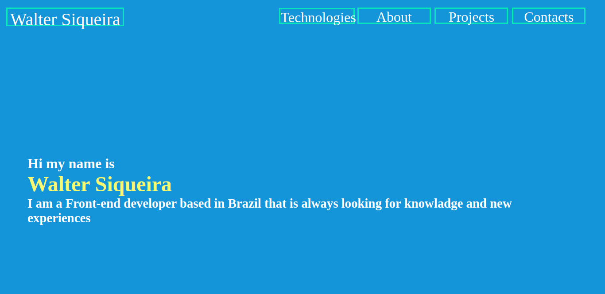

# Portfolio project
This project is a portfolio page created by me and for me that show more about myself and my other projects

## Table of contents
 -[Overview](#overview)
	 -[screenshot](#screenshot)
	 - [links](#links)
-[Project description](#project-description)
	-[built with](#built-with)
	-[what i learned](#what-i-learned)
	-[Author](#author)

## Overview

### Screenshot

### Links

-Solution URL: [github](https://github.com/WalterSiqueira/portifolio_page)
-Live Site URL: [portfolio](https://portifolio-page-walter.vercel.app/)

### Project description
- Responsive layout
- Semantic HTML5 
- CSS grid
- Sass preprocessor
- Javascript
- React.js
- useRef
### What i learned
In this project i learned how to use events in react and make animations in react

## Author 
- Github - [WalterSiqueira](https://github.com/WalterSiqueira) 
- Twitter - [@Walter__BS](https://twitter.com/Walter__BS)
-  Linkedin - [walter siqueira](https://www.linkedin.com/in/walter-siqueira/)